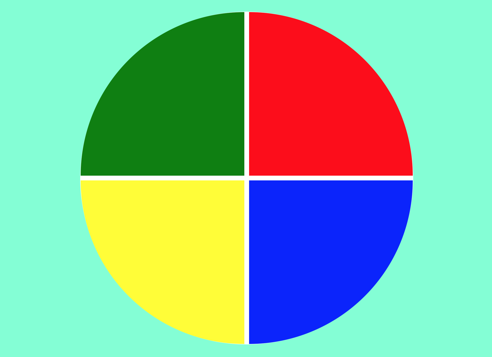

# Desafio Criar o jogo Genius

Esta é uma solução para o desafio da Digital Innovation One. O desafio consiste em recriar o jogo Genius. Genius era um brinquedo muito popular na década de 1980 distribuído pela Brinquedos Estrela

### O desafio

Os usuários devem ser capazes de criar:

- O sistema do jogo baseado em cores

- Criar a inteligência do jogo para que o mesmo faça o sorteio das cores de forma randômica.

### Construído com:

- Marcação HTML5 semântica
- Propriedades personalizadas CSS
- Flexbox
- Javascript
